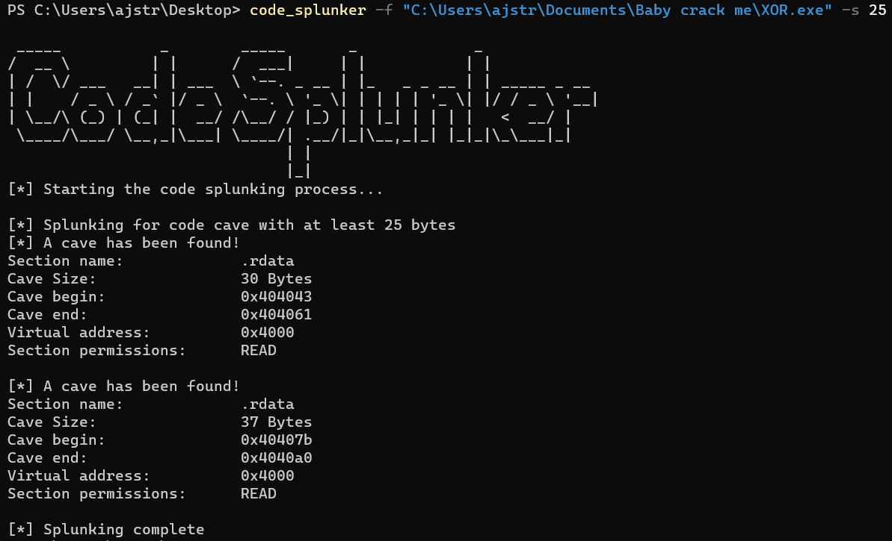

# Code_Splunker
Code_Splunker is a command-line tool for windows that helps security researchers, CTF enjoyers to find code caves within an executable or ELF file.  

Code caves are a section of memory within a programs code that is not used by the program. Payloads can be injected into code caves to modify the codes execution flow.  

code_splunker uses the pefile and elf modules to parse the contents of the file and identify code caves based on a minimum desired size.This project was inspired after reading this article [here](https://www.codeproject.com/Articles/20240/The-Beginners-Guide-to-Codecaves) . And noticing many other code cave finding tools are outdated or no longer supported.  

## Usage
``` code_splunker -f <path_to_file> -s <minimum size of cave> ```  
<path_to_file> should be replaced with the path of the file you want to analyze  

## Installation
``` 
git clone https://github.com/Ajstroze/code_splunker  
cd code_splunker  
pip install .  
```  
## Example


### Contributing
Thank you for considering contributing to this project!  
Please report any bugs, questions, or requests in the issues section.  
Any pull requests are welcome and will be reviewd as I have time. Please leave clear commit messages and clean code.  
For any feature requests, or if you are adding in new features, add proper documentation and reach out to discuss the additions before creating a pull request.
### License
Released under GPL3 License  
